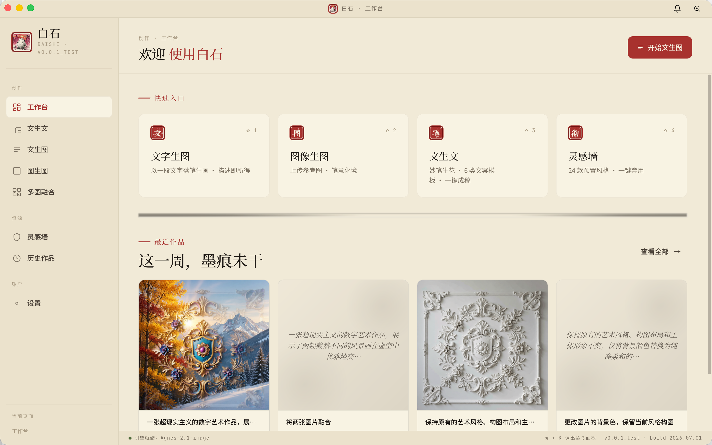
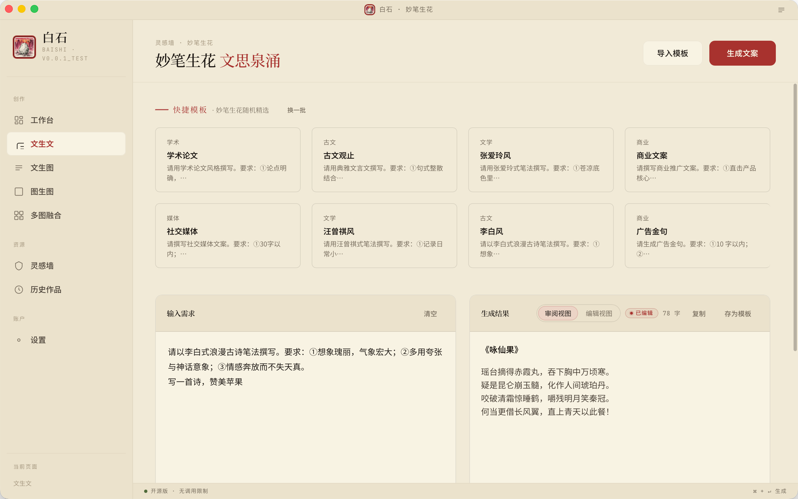
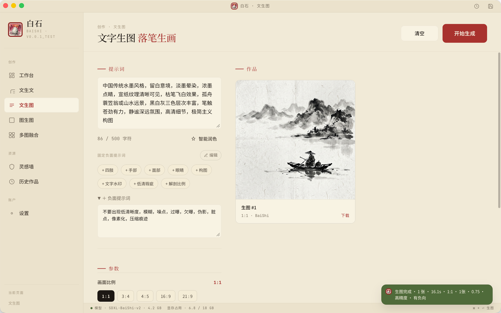
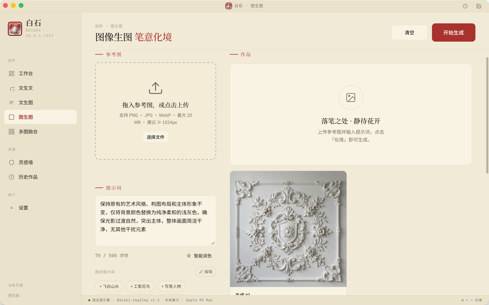
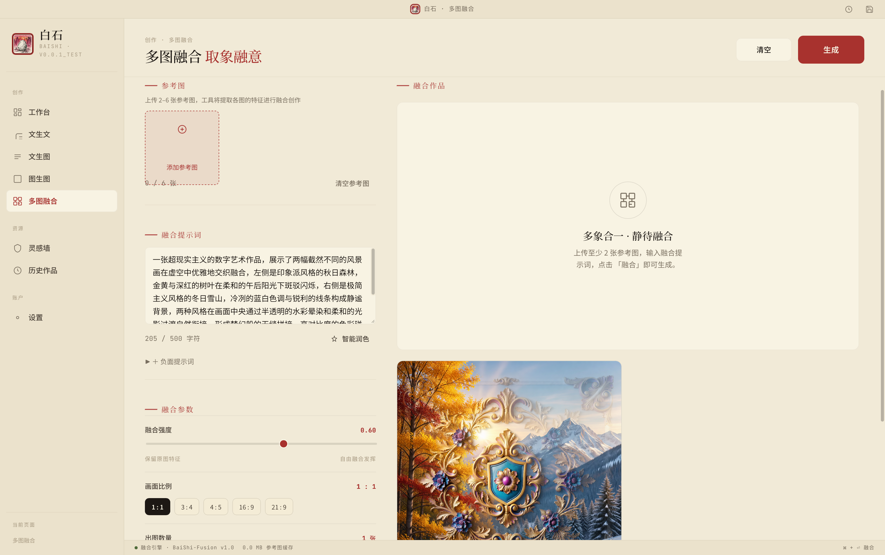
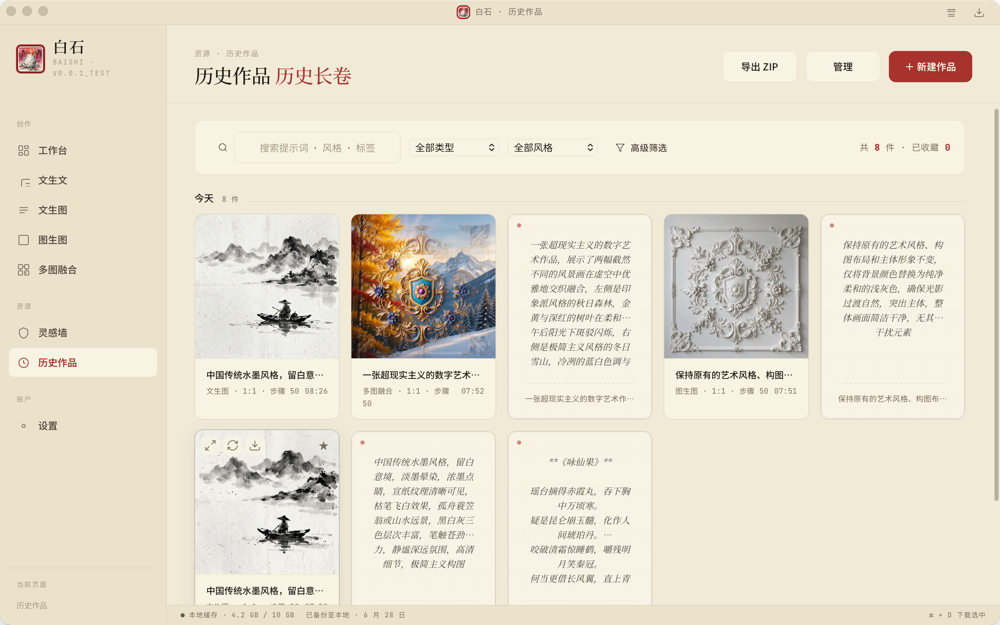
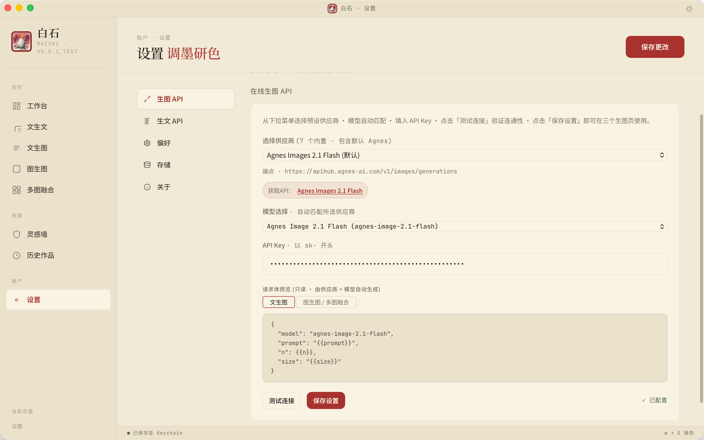
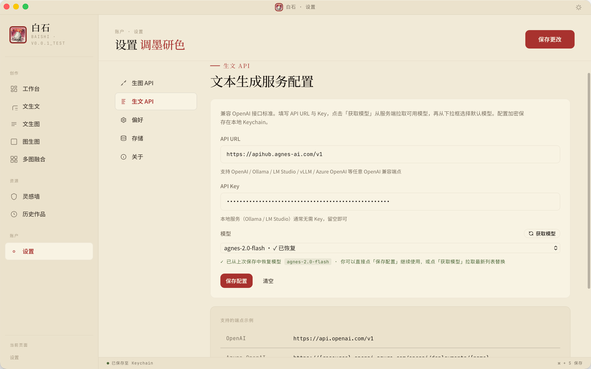
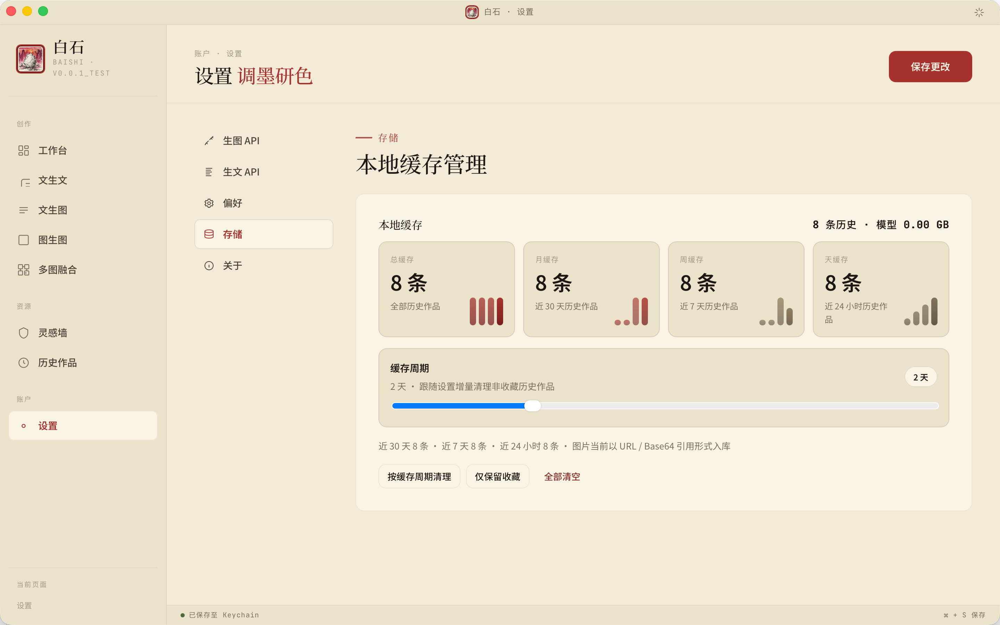
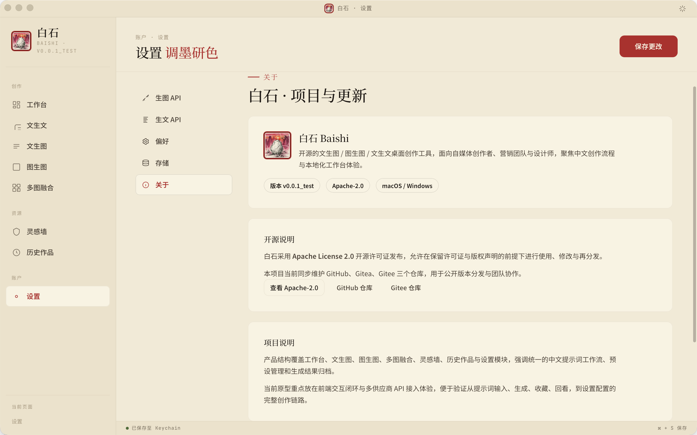

<div align="center">
  
  <h1>白石 BaiShi</h1>
  <p>本地优先的中文创作工作台，整合文生文、文生图、图生图、多图融合、灵感墙与历史管理。</p>
</div>

<p align="center">
  
  
  
  
  
  
  
</p>

<p align="center">
  <a href="./src-tauri/API.md"></a>
  <a href="./docs/RELEASE.md"></a>
  <a href="./docs/TROUBLESHOOTING.md"></a>
  <a href="./docs/Developer.md"></a>
</p>

白石是一个本地优先的桌面生图原型项目，面向自媒体创作者、营销和设计师。当前仓库包含一套可直接打开联调的前端页面，以及一套 Rust 后端，用于本地持久化、历史记录管理、预设管理和第三方图像/文本生成接口转发。

当前版本：`v0.1.4`
开源许可证：Apache License 2.0

## 仓库概览

| 维度 | 当前实现 |
| --- | --- |
| 产品定位 | 本地优先的中文创作工作台 |
| 核心能力 | 文生文、文生图、图生图、多图融合、灵感墙、历史作品、设置中心 |
| 桌面框架 | Tauri 2 |
| 后端能力 | Rust + Axum + Reqwest + Rusqlite |
| 前端形态 | 多页面 HTML / CSS / Vanilla JS |
| 持久化 | SQLite + localStorage |
| 运行模式 | 打包态优先 `invoke`，开发态回退本地 HTTP |
| 发布方式 | GitHub Actions 官方 Tauri Action |

## 技术栈标识


## 架构标识

- `front/`：多页面桌面前端，负责界面、交互、任务中心与本地回退逻辑
- `src-tauri/src/commands`：打包态 Tauri `invoke` 命令层，承接核心生成与设置链路
- `src-tauri/src/server_http.rs`：开发联调用本地 HTTP 服务
- `src-tauri/src/storage`：SQLite 持久化、历史、预设、设置与清理逻辑
- `src-tauri/src/inference`：图像 / 文本供应商请求组装与结果解析

## 状态面板

- 当前版本：`v0.1.4`
- 页面数量：`8` 个核心功能页
- 本地缓存策略：默认 `2` 天，可配置 `1–5` 天
- 当前发布产物：`arm64 dmg`、`intel dmg`、`x86_64 exe`、`deb`、`rpm`
- 当前推荐验收基线：本地 `.app` 与 GitHub Actions 官方安装包

## 当前状态

- 前端为多页面桌面应用原型，入口在 `front/index.html`
- 功能页共 8 个：工作台、文生文、文生图、图生图、多图融合、灵感墙、历史作品、设置
- 设置页已内置“关于”面板，包含开源说明、项目说明和检查更新入口
- “检查更新”当前会真实读取 GitHub Releases 最新版本信息，并与本地版本比较
- 后端以 `baishi-dev` HTTP 服务为主，默认端口 `3456`
- 打包态核心功能优先走 Tauri `invoke`，开发态或注入缺失时回退本地 HTTP `http://localhost:3456`
- 图像生成走“用户可配置供应商 + 请求体模板”模式，不内置本地模型
- 文案生成走独立的生文 API 配置
- 历史作品、收藏状态、预设和设置保存在本地 SQLite
- 图片历史当前保存的是远程 URL / Base64 引用，不会默认落盘为本地图片文件
- 历史作品默认按 2 天做增量清理，设置页“存储”面板可调为 1–5 天
- 文生文、文生图、图生图、多图融合已接入全局任务中心，切换页面后可恢复生成状态
- 当前桌面端以单用户本地模型运行，业务数据默认按 `user_id = 1` 处理

## 项目结构

```text
Qi_Baishi/
├── front/
│   ├── index.html
│   ├── css/
│   ├── js/
│   └── pages/
├── src-tauri/
│   ├── src/
│   ├── API.md
│   ├── Cargo.toml
│   └── tauri.conf.json
├── assets/
├── docs/
└── README.md
```

## 界面预览

### 工作台



工作台作为统一创作入口，集中展示快捷入口、最近作品和当前创作节奏，适合在启动应用后快速回到最近一次工作状态。

### 文生文



### 文生图



### 图生图



### 多图融合



### 灵感墙


### 灵感详情弹层


### 历史作品



### 设置：生图 API



### 设置：生文 API



### 设置：存储



### 设置：关于



## 界面功能说明

### 统一桌面框架

- 左侧侧边栏提供创作区、资源区、账户区的稳定导航
- 顶部标题栏保留桌面应用节奏，配合页面标题和全局动作入口
- 所有主页面共享统一的米白水墨主题、按钮节奏、提示与状态反馈

### 创作区

- 工作台：整合快捷入口、最近作品和创作概览，适合作为主入口
- 文生文：内置快捷模板，支持“审阅视图 / 编辑视图”切换，适合写文案、标题、短诗和结构化文本
- 文生图：基于文本提示词与负面提示词生成图片，支持比例、参数和结果卡片预览
- 图生图：上传单张参考图后进行风格迁移、重绘或局部意境改写
- 多图融合：上传 2–6 张参考图后融合主体、构图和氛围特征，生成新的综合作品

### 资源区

- 灵感墙：集中管理画廊和妙笔生花素材，支持分类筛选、搜索、收藏和一键“使用”
- 灵感详情弹层：展示示例图、提示词、推荐强度和比例，可直接带入文生图流程
- 历史作品：统一查看图片与文案历史，支持收藏筛选、管理、导出和继续复用

### 设置区

- 生图 API：配置图像供应商、端点、API Key 与请求体模板，并可直接测试连接
- 生文 API：配置兼容 OpenAI 风格的文本接口、模型拉取与默认模型保存
- 存储：查看总 / 月 / 周 / 天四组缓存统计，调节缓存周期，并按策略清理非收藏历史
- 关于：查看项目简介、开源协议、仓库入口和版本信息，作为应用内的项目说明页

## 页面说明

### `front/index.html`

项目入口和落地页，提供版本信息和首次配置引导。

### `front/pages/workspace.html`

工作台首页，展示快捷入口、最近作品、趋势和概览信息。

### `front/pages/copywriting.html`

文生文页面。生成完成后默认进入“审阅视图”，可切换到“编辑视图”直接编辑原始文本。

### `front/pages/text-to-image.html`

文生图页面，支持固定负面提示词、参数控制、结果卡片预览和原图放大。

### `front/pages/image-to-image.html`

图生图页面，支持上传参考图、负面提示词、重绘强度和结果对比。

### `front/pages/multi-image.html`

多图融合作图页面，支持多张参考图输入。

### `front/pages/presets.html`

灵感墙页面，包含图像风格和文案风格两类素材的浏览、管理和编辑。

### `front/pages/history.html`

历史作品页，支持图片和文案混合展示、收藏筛选、批量管理、图片大图预览、文案全文弹层。

### `front/pages/settings.html`

设置页，包含图像 API、生文 API、存储、偏好和“关于”面板。

当前安装版中的外链入口为了兼容不同桌面环境，已统一调整为：直接显示原始链接，点击后复制到剪贴板，由用户自行粘贴到浏览器打开。这一策略目前覆盖“生图 API”中的“获取API”和“关于”面板中的仓库发布页入口。

其中“关于”面板当前承担应用内说明页角色，主要包含：

- 项目名称、版本、平台与许可证信息
- 开源说明与仓库入口
- 项目定位与功能概述
- 发布页 / 更新相关入口

其中“存储”面板当前展示的是历史缓存统计：

- 图片缓存：历史作品中图片类记录条数
- 文本缓存：历史作品中文案类记录条数
- 总 / 月 / 周 / 天：历史作品分段计数卡片
- 缓存周期：1–5 天，默认 2 天，仅清理超过周期的非收藏历史作品
- 模型占用：本地 `models/` 目录体积

说明：当前版本不以“本地图片文件体积”作为缓存统计口径，因为生成结果仍以 URL / Base64 引用形式入库。

## 技术栈

- 前端：HTML、CSS、原生 JavaScript
- 后端：Rust、Axum、Reqwest、Rusqlite、Tauri 2
- 持久化：SQLite + 本地 `localStorage`
- 联调方式：
  - 开发期：HTTP 服务 `baishi-dev`
  - 打包期：Tauri `invoke` 命令

## 接口与运行链路

- 开发联调：`baishi-dev` 提供本地 HTTP API，默认基址为 `http://localhost:3456/api`
- 打包桌面端：前端优先调用 Tauri `invoke` 命令，核心入口在 `front/js/api-client.js`
- 当前页面主链路已优先迁移到 Rust 远程命令层：
  - 文生图
  - 图生图
  - 多图融合
  - 文案生成
  - 提示词润色
- 当前 HTTP / Tauri 命令的完整请求体、返回结构、默认值和约束，以 [src-tauri/API.md](src-tauri/API.md) 为唯一准确信息源

当前特别需要注意：

- 图生图 / 多图融合至少需要一张参考图
- Agnes I2I 请求体当前已按官方格式收口为顶层 `image: string[]`，`response_format` 位于 `extra_body`
- 图像历史记录当前保存 URL / Base64 引用，不等同于本地图片文件缓存
- `cancel_job` 在当前实现中仍未真正支持，调用会返回未实现错误

## 最近关键修复（2026-07-02）

- 补齐了打包态核心链路的 Tauri 命令：
  - 文生图
  - 图生图
  - 多图融合
  - 文案生成
  - 提示词润色
- `front/js/api-client.js` 已统一为：
  - 优先尝试 `Tauri invoke`
  - 失败、开发态或注入缺失时回退本地 HTTP API
- 文生文 / 文生图 / 图生图 / 多图融合 已接入任务中心：
  - 生成开始后写入全局任务状态
  - 切页后返回可恢复 `running / success / error`
  - 残留 `running` 任务会自动过期，避免页面永久卡在“生成中”
- 图生图 / 多图融合的 I2I 请求体已按 Agnes 官方文档调整：
  - `image` 使用顶层 `string[]`
  - `response_format` 位于 `extra_body`
- 设置页“存储”面板已按总 / 月 / 周 / 天展示历史缓存统计，并支持按缓存周期自动清理
- 本地 `cargo tauri build` 可稳定产出 `.app`，但本地 DMG 脚本链路不稳定；发布安装包已切换为 GitHub Actions 官方 Tauri Action 构建

## 快速开始

### 1. 启动开发 HTTP 服务

```bash
cargo run --manifest-path src-tauri/Cargo.toml --bin baishi-dev
```

默认会启动在：

```text
http://localhost:3456
```

启动后可直接访问：

- `http://localhost:3456/`
- `http://localhost:3456/pages/workspace.html`

### 1.1 打包态联通说明

- 开发浏览器访问时，页面默认通过 `http://localhost:3456` 与本地服务通信
- 打包后的桌面应用，核心数据请求优先走 Tauri `invoke`
- 若打包态页面出现“未检测到 Tauri invoke”提示，优先怀疑安装包产物问题，而不是页面业务逻辑

### 2. 自定义端口

```bash
BAISHI_PORT=3458 cargo run --manifest-path src-tauri/Cargo.toml --bin baishi-dev
```

### 3. 配置 API

进入“设置”页后：

- 在“图像 API”中选择供应商、填写 API Key、端点和请求体模板
- 在“生文 API”中填写 URL、API Key 和模型

未配置时，相关页面会给出本地提示，不会隐式调用远端服务。

## 后端二进制

`src-tauri/Cargo.toml` 当前定义了 3 个二进制目标：

- `baishi-dev`：开发联调用 HTTP 服务器，最常用
- `baishi-server`：命令行测试入口，会做一轮后端能力验证
- `baishi`：Tauri 桌面入口

## 打包与发布

### 本地构建

```bash
cargo tauri build
```

说明：

- 当前本地构建得到的 `.app` 可作为 macOS 本地测试基线
- 本地 DMG 封装链路曾出现与 `.app` 行为不一致的问题，不再作为推荐发布方式

### GitHub Actions 官方构建链路

当前仓库使用：

- `.github/workflows/build-installers.yml`
- 官方 `tauri-apps/tauri-action`

发布产物目标：

- `BaiShi-arm64.dmg`
- `BaiShi-intel.dmg`
- `BaiShi-x86_64-setup.exe`
- `BaiShi-x86_64.deb`
- `BaiShi-x86_64.rpm`

建议发布方式：

1. 提交代码并 push
2. 打 `v*` tag
3. 由 GitHub Actions 构建安装包并自动发布到 GitHub Releases

更完整的发布流程、产物说明和已知限制，见 [docs/RELEASE.md](docs/RELEASE.md)。

## 数据与隐私

- SQLite 在运行时写入应用数据目录下的 `baishi.db`
- 当前仓库中的 `src-tauri/baishi.db` 已在 `.gitignore` 中忽略
- 图像 API Key 会保存在本地设置中；前端还会将部分配置写入 `localStorage`
- 历史作品页中的收藏、预设、文案历史都属于本地数据

## 开发约定

- 前端是多页面结构，不是 SPA
- 页面共用 `front/css/app-chrome.css` 和 `front/js/baishi-shared.js`
- 右下角操作提示统一走共享 `toast`
- 页面切换动画当前已取消，`page-loader.js` 只负责安全隐藏加载层
- 文档以当前代码为准，不再沿用旧版本中的本地模型、登录页和订阅体系描述

## 常用检查

前端脚本语法检查：

```bash
node --check front/js/settings.js
node --check front/js/history.js
node --check front/js/text-to-image.js
node --check front/js/copywriting.js
```

后端编译检查：

```bash
cargo check --manifest-path src-tauri/Cargo.toml --bin baishi-dev
```

## 相关文档

- [docs/Developer.md](docs/Developer.md)
- [docs/AGENT.md](docs/AGENT.md)
- [docs/DEVELOPER/front.md](docs/DEVELOPER/front.md)
- [docs/DEVELOPER/server.md](docs/DEVELOPER/server.md)
- [docs/RELEASE.md](docs/RELEASE.md)
- [docs/TROUBLESHOOTING.md](docs/TROUBLESHOOTING.md)
- [src-tauri/API.md](src-tauri/API.md)

阅读建议：

- 想看项目总览、启动方式、构建发布：先看本 README
- 想看真实接口、请求体、返回结构、默认值：看 `src-tauri/API.md`
- 想看前端页面和脚本分工：看 `docs/DEVELOPER/front.md`
- 想看后端模块和服务结构：看 `docs/DEVELOPER/server.md`
- 想看打包、tag、GitHub Actions、Releases：看 `docs/RELEASE.md`
- 想看 `Tauri invoke`、DMG、3456 端口、Actions 下载等排障：看 `docs/TROUBLESHOOTING.md`

文档维护约定：

- `src-tauri/API.md` 是唯一准确的接口文档来源
- 本 README 只保留高层接口摘要，不重复维护完整请求体和返回结构
- `docs/DEVELOPER/server.md` 不再重复列出详细接口清单，而是聚焦后端实现结构与运行方式
